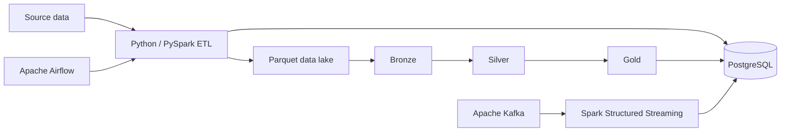

# Data Engineering Portfolio

Production-style data engineering projects by
[Dipti Sahu](https://github.com/Dipti-Coder202), demonstrating a progression
from Python ETL fundamentals to warehousing, real-time streaming, Airflow
orchestration, and incremental PySpark lake pipelines.

## Portfolio overview

The repository uses one retail-sales domain so that each project can focus on
a new engineering concern without hiding the progression behind unrelated
business examples.

## Featured projects

| Project | Engineering focus | Main technologies |
|---|---|---|
| [Project 7: PySpark Medallion Pipeline](Project7_RetailSales_PySpark/) | Incremental JDBC extraction, Bronze/Silver/Gold Parquet, compound watermark, quarantine, reconciliation, AQE, tests | PySpark, Airflow, PostgreSQL, Parquet, pytest |
| [Project 6: Airflow ETL](Project6_RetailSales_Airflow/) | DAG orchestration, retries, task logs, incremental/upsert-style processing | Airflow, Python, PostgreSQL |
| [Project 5: Kafka Streaming](Project5_RetailSales_KafkaStreaming/) | Event production, Structured Streaming, checkpointing, micro-batches, database upserts | Kafka, PySpark, Docker, PostgreSQL |
| [Project 4: Retail Data Warehouse](Project4_Retail_DataWarehouse/) | Dimension and fact loading, analytical schema, staged warehouse ETL | Python, SQL, PostgreSQL |
| [Project 3: Dockerized Pipeline](Project3_RetailSales_Docker/) | Reproducible database and pipeline infrastructure | Docker Compose, Python, PostgreSQL |
| [Project 2: PySpark to PostgreSQL](Project2_RetailSales_Postgres/) | Spark transformation and JDBC database loading | PySpark, PostgreSQL, JDBC |
| [Project 1: ETL Foundations](Project1_RetailSales_ETL/) | Raw ingestion, transformation, Parquet and CSV output | Python, PySpark, Parquet |

## Skills demonstrated

- Batch and streaming data pipelines
- PySpark DataFrames, Spark SQL, window functions, caching, and AQE
- Apache Kafka producers and Structured Streaming consumers
- Apache Airflow DAGs, branching, retry behavior, and run visibility
- PostgreSQL source systems, warehouse schemas, staging, and upserts
- Incremental loads, compound watermarks, deduplication, and idempotency
- Bronze–Silver–Gold architecture and columnar Parquet storage
- Data-quality gates, reconciliation, invalid-record quarantine, and lineage
- Docker-based local infrastructure, environment-backed configuration, and Git
- Automated PySpark tests and repository-level continuous integration

## Recommended review path

For the strongest production-oriented examples, begin with Project 7, then
review Projects 5 and 6 for streaming and orchestration. Projects 1–4 show the
foundation and design progression behind those later pipelines.

Each featured project contains its own setup and execution guidance. Project 7
has the most complete documentation, including architecture, data contracts,
manual commands, Airflow execution, optimization decisions, troubleshooting,
and interview-ready explanations.

## Repository quality

The portfolio CI workflow validates Python syntax, shell syntax, the Project 7
Airflow DAG definition, and its local PySpark unit tests. Secrets, runtime logs,
virtual environments, Spark output, Airflow metadata, JDBC binaries, and local
state are excluded through Git ignore rules.

## Contact

- GitHub: [Dipti-Coder202](https://github.com/Dipti-Coder202)
- Profile overview: [Professional Data Engineer README](https://github.com/Dipti-Coder202)

I am open to Data Engineer opportunities involving batch processing,
streaming, distributed data systems, orchestration, and analytics platforms.
